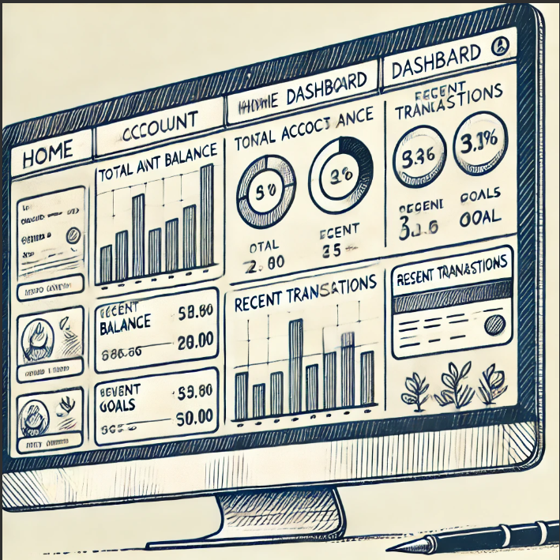
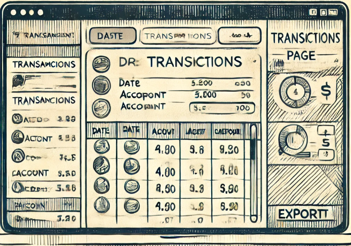
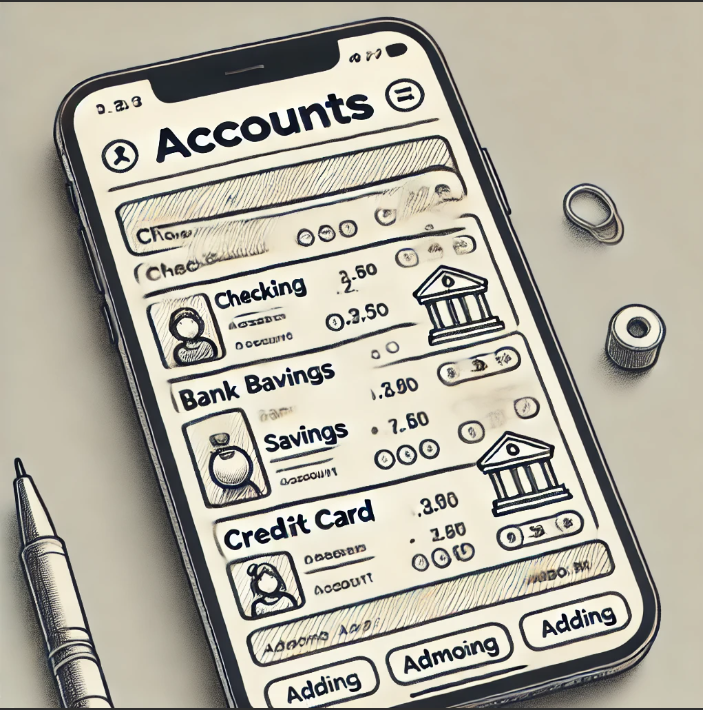
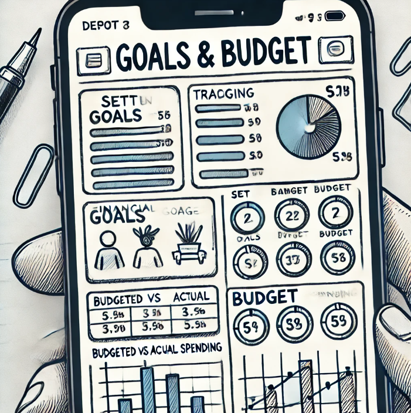

# Project Title

## Overview
A financial app that brings all your transactions from different banks together to then create a personal ledger and for you to correctly budget for your goals. 

30 second pitch:
Introducing **FinanceFusion**, the ultimate financial app designed to seamlessly track all your transactions across multiple bank platforms like Chase, Capital One, and Discover. With FinanceFusion, you can effortlessly monitor your spending, income, and account balances in one unified dashboard. Say goodbye to the hassle of juggling multiple banking apps and hello to a streamlined financial overview. Our intuitive interface and robust security features ensure your data is safe and easily accessible. Take control of your finances today with FinanceFusion "where your money meets simplicity." Download now and experience financial harmony!

### Problem
People use different bank accounts and credit cards which causes you to loose sight of your transactions and monthly payments. 
People need to see all of their transactions in one place so that they can make better financial decisions and use ai to create a budget. 

1. Multiple Banking Platforms
    - consolidating all of your accounts into one unified dashboard providing a comprehensive view of your finances.
2. Manual Tracking
    - Automated finaincial up-to-date records without the hassle of manual entry.
3. Budget Management
    - Monitor spending in real-time, making it easier to stay within budget and identify areas for improvement.
4. Financial Overviews
    - offers insights and analytics to provide a clear picture of your financial situation and helping you make informed decisions. 
5. Time Management
    - saves you time by providing a simple palce to manage all your financial activities, freeing up time for other important tasks.
6. Missed Transactions
    - all transactions are recorded and easily accessible, which helps you avoid missed or unnoticed financial activities.

### User Profile
Anyone that want to see their monthly payments and have a financial goal to achieve. People that want to know how much money they need to make in order to achieve a financial goal. People that want to know the next steps they must take to reach their financial goals; for example, changing jobs, getting a raise, stopping subscription. 

### Features
-Different bank accounts and credit card api connections
-A stylish overall transaction page with a great theme
-Responsive graphs for future payments and current payments

## Implementation

### Tech Stack
1. html
2. scss / css libraries
3. javascript
4. react
5. api libraries 
6. ploting javascripts
7. event driven system
8. Mysql
9. Express
10. Client libraries
    - react
    - react-router
    - axios
    - dotenv
    - scss
11. Server libraries
    - knex
    - express
    - nodemon
    - mysql2
    - helmet
    - dotenv
    - bycrypt

### APIs
No external APIs will be used for the first project 

### Sitemap

1. Home/Dashboard
    - A central page displaying an overview of all connected bank accounts and credit cards. Includes a summary of total balances, recent transactions, and a snapshot of progress toward financial goals. Users can see a consolidated view of their financial health at a glance.
2. Transactions Page
    - A detailed breakdown of all transactions from different bank accounts and credit cards, searchable and filterable by date, account, or type of transaction. Users can categorize transactions and mark important payments.
3. Goals & Budget Page 
    - A page where users can set financial goals (e.g., saving for a car, paying off debt) and create a budget with AI assistance. It will show real-time progress toward their goals, with suggestions on how to adjust spending to meet those goals.
4. Accounts Page
    - A management page for linking new bank accounts, credit cards, or loan accounts. Users can see which financial institutions are connected and remove or update account information.
5. Reports & Analytics Page
    - A page displaying graphs and insights on financial activity, including income vs. expenses, monthly spending patterns, and loan management. It provides both past and projected future spending based on current data.

### Mockups

Provide visuals of your app's screens. You can use tools like Figma or pictures of hand-drawn sketches.

#### Desktop Page

#### Transaction Page

#### Account Page

#### Goals & Budgets Page

#### Reports & Analytics Page

### Data

Describe your data and the relationships between them. You can show this visually using diagrams, or write it out. 

1. User
    - Represents a person using the app.
    - Attributes: user_id, name, email, password, profile, financial_goals, budget, linked_accounts.
2. Account
    - Represents a bank account or credit card connected by the user.
    - Attributes: account_id, user_id, bank_name, account_type (e.g., checking, savings, credit), balance, account_number.
    - Relationships: An account is linked to one user but a user can have many accounts.
3. Transaction
    - Represents individual transactions, such as payments or deposits, made through an account.
    - Attributes: transaction_id, account_id, amount, transaction_type (income/expense), category (e.g., groceries, rent), date, description.
    - Relationships: Each transaction is tied to one account, but an account can have many transactions.
4. Goal
    - Represents a financial goal set by the user, like saving for a vacation or paying off debt.
    - Attributes: goal_id, user_id, goal_type, target_amount, current_savings, deadline.
    - Relationships: A goal is linked to one user, but a user can have multiple goals.
5. Budget
    - Represents the user’s budget plan, indicating how much they plan to spend or save within specific categories.
    - Attributes: budget_id, user_id, category, budgeted_amount, actual_spent.
    - Relationships: A budget belongs to one user, and the user can have multiple budgets for different categories.
6. Loan
    - Represents loans the user is managing through the app, like student loans or mortgages.
    - Attributes: loan_id, user_id, loan_type, outstanding_balance, interest_rate, payment_schedule.
    - Relationships: A loan is linked to one user, but a user can manage multiple loans.
7. Credit Score
    - Represents the user's credit data.
    - Attributes: score_id, user_id, current_score, score_history, credit_utilization.
    - Relationships: A credit score is linked to one user, providing insights into their credit performance.
    
Relationships:
    - User ↔ Accounts: A user can have multiple financial accounts (one-to-many relationship).
    - Account ↔ Transactions: Each account can have many transactions (one-to-many relationship).
    - User ↔ Goals: A user can set multiple financial goals (one-to-many relationship).
    - User ↔ Budgets: A user can define multiple budgets for different expense categories (one-to-many relationship).
    - User ↔ Loans: A user can manage multiple loans (one-to-many relationship).
    - User ↔ Credit Score: A user has one credit score record that gets updated over time.

### Endpoints

List endpoints that your server will implement, including HTTP methods, parameters, and example responses.

//User Registration & Authenticaiton
1. POST /api/register
    - Description: Registers a new user.
    - Paramerters: name, email, password
    - Example Request {
        "name": "John Doe",
        "email": "johndoe@example.com",
        "password": "securepassword123"
    }
    - Example Response {
        "user_id": 1,
        "message": "User registered successfully"
    }
2. POST /api/login
    - Description: Authenticates a user and returns a token.
    - Parameters: email, password
    - Example Request {
        "email": "johndoe@example.com",
        "password": "securepassword123"
    }
    - Example Response{
        "token": "Secret_key",
        "message": "Login successful"
    }

//Accounts Management
1. GET /api/accounts
    - Description: Retrieves all connected accounts for the authenticated user.
    - headers: Authorization: Bearer <token>
    - Example Response:[
    {
        "account_id": 101,
        "bank_name": "Chase",
        "account_type": "Checking",
        "balance": 2500.75
    },
    {
        "account_id": 102,
        "bank_name": "Capital One",
        "account_type": "Credit Card",
        "balance": -500.00
    }
    ]
2. POST /api/accounts
    - Description: Adds a new bank or credit card account.
    - Parameters: bank_name, account_type, balance, account_number
    - Example Request:{
    "bank_name": "Wells Fargo",
    "account_type": "Savings",
    "balance": 1000.00,
    "account_number": "987654321"
    }
    - Example Response:{
    "account_id": 103,
    "message": "Account added successfully"
    }
3. DELETE /api/accounts/{account_id}
    - Description: Deletes a connected account.
    - Parameters: account_id (in URL path)
    - Example Response:{
    "message": "Account deleted successfully"
    }

//Transactions Management
1. GET /api/transactions
    - Description: Retrieves all transactions across connected accounts.
    - Headers: Authorization: Bearer <token>
    - Query Parameters: Optional start_date, end_date, account_id
    - Example Response:[
    {
        "transaction_id": 201,
        "account_id": 101,
        "amount": -45.00,
        "transaction_type": "Expense",
        "category": "Groceries",
        "date": "2024-09-01",
        "description": "Grocery Store"
    },
    {
        "transaction_id": 202,
        "account_id": 102,
        "amount": 1500.00,
        "transaction_type": "Income",
        "category": "Salary",
        "date": "2024-09-01",
        "description": "Paycheck"
    }
    ]
2. POST /api/transactions
    - Description: Adds a new transaction to an account.
    - Parameters: account_id, amount, transaction_type, category, date, description
    - Example Request:{
        "account_id": 101, 
        "amount": -100.00,
        "transaction_type": "Expense",
        "category": "Utilities",
        "date": "2024-09-10",
        "description": "Electricity Bill"
    }
    - Example Response:{
    "transaction_id": 203,
    "message": "Transaction added successfully"
    }

//Goals & Budget Management
1. GET /api/goals
    - Description: Retrieves all financial goals for the user.
    - Headers: Authorization: Bearer <token>
    - Example Response:[
    {
        "goal_id": 301,
        "goal_type": "Save for Vacation",
        "target_amount": 5000,
        "current_savings": 1000,
        "deadline": "2025-06-01"
    }
    ]
2. POST /api/goals
    - Description: Adds a new financial goal.
    - Parameters: goal_type, target_amount, current_savings, deadline
    - Example Request:{
    "goal_type": "Emergency Fund",
    "target_amount": 10000,
    "current_savings": 2000,
    "deadline": "2026-12-31"
    }
    - Example Response:{
    "goal_id": 302,
    "message": "Goal created successfully"
    }
3. GET /api/budgets
    - Description: Retrieves the user's budget for different categories.
    - Headers: Authorization: Bearer <token>
    - Example Response:[
    {
        "budget_id": 401,
        "category": "Groceries",
        "budgeted_amount": 500,
        "actual_spent": 450
     },
    {
        "budget_id": 402,
        "category": "Entertainment",
        "budgeted_amount": 200,
        "actual_spent": 150
    }
    ]

//Loan Management
1. GET /api/loans
    Description: Retrieves all active loans for the user.
    Headers: Authorization: Bearer <token>
    Example Response:
    [
    {
        "loan_id": 501,
        "loan_type": "Student Loan",
        "outstanding_balance": 15000,
        "interest_rate": 4.5,
        "payment_schedule": "Monthly"
    }
    ]

//Credit Score Management
1. GET /api/credit-score
    - Description: Retrieves the user's current credit score and history.
    - Headers: Authorization: Bearer <token>
    - Example Response:{
    "current_score": 720,
    "score_history": [
    {
        "date": "2024-08-01",
        "score": 710
    },
    {
        "date": "2024-07-01",
        "score": 705
    }
    ],
    "credit_utilization": 30
    }

### Auth

Does your project include any login or user profile functionality? If so, describe how authentication/authorization will be implemented.

Authentication and authorization for FinanceFusion will be implemented using a JWT (JSON Web Token)-based approach to ensure secure access to user data. Here's an overview of the implementation process:

1. User Registration
    - Endpoint: POST /api/register
    - When a new user registers, their password will be hashed using a secure hashing algorithm (such as bcrypt) to ensure it is stored safely in the database.
    - Once the user’s registration is successful, they will receive a success message, but no token is issued at this stage.
2. User Login and Token Generation
    - Endpoint: POST /api/login
    - After the user submits their credentials (email and password), the backend will:
        - Verify that the email exists in the database.
        - Compare the provided password with the hashed password stored in the database.
        - If the credentials are valid, the server generates a JWT token.
    - The JWT will contain the user’s user_id and other relevant information in its payload, encoded using a secret key on the server.
    - This token is then returned to the user in the response.
3. Token Storage
    - The client (e.g., browser, mobile app) will store the JWT token securely, typically in local storage or session storage (for web apps) or secure storage solutions (for mobile apps).
    - The token is attached to the headers of future API requests to authenticate the user.
4. Protected Routes (Authorization)
    - All sensitive endpoints (such as accessing accounts, transactions, goals) will require the user to be authenticated.
    - To access protected routes, the client must send the JWT token in the Authorization header as a Bearer Token.
    - On the server, a middleware function will intercept the request to verify the JWT token. The verification process involves:
        - Checking if the token is provided in the request header.
        - Decoding the token using the server’s secret key.
        - If the token is valid, the middleware will grant access to the protected route and attach the user information (e.g., user_id) to the request object.
        - If the token is missing or invalid, the request will be denied with a 401 Unauthorized response.
5. Token Expiration and Renewal
    - JWT tokens will have an expiration time (e.g., 1 hour) to ensure the tokens are not valid indefinitely.
    - After token expiration, users will need to log in again to obtain a new token.
    - For convenience, refresh tokens can be implemented to automatically generate new access tokens without requiring the user to log in again. The refresh token would have a longer expiration period and be stored more securely.
6. Logout and Token Revocation
    - On logout, the client will simply delete the stored JWT token from local/session storage.
    - Since JWT tokens are stateless, there’s no need to explicitly revoke the token on the server side. Once the token expires or is deleted, the user will no longer have access to protected routes.
7. Securing Data in Transit
    - All communication between the client and server will be encrypted using HTTPS to ensure that tokens and sensitive data cannot be intercepted by malicious actors.
8. Additional Security Measures
    - Rate limiting will be applied to sensitive routes like login and registration to prevent brute force attacks.
    - Token invalidation could be implemented by maintaining a blacklist of revoked tokens, particularly in cases where a user’s account is compromised or manually logged out from the server side.

## Roadmap

Scope your project as a sprint. Break down the tasks that will need to be completed and map out timeframes for implementation. Think about what you can reasonably complete before the due date. The more detail you provide, the easier it will be to build.

Sprint Timeline Overview:
Sprint 1: Basic UI Design and Theme Setup
1. Project Setup
    - Create the React app project using create-react-app or a similar tool.
    - Set up SCSS/CSS for global styling.
    - Install necessary libraries (e.g., React Router, CSS frameworks like Bootstrap or Tailwind).
2. Navigation & Basic Pages
    - Implement routing for basic pages: Home, Login, Register, Dashboard.
    - Create a responsive navigation bar and footer.
3. Create Basic UI Layouts
    - Design wireframes/mockups (can be done concurrently) for Home, Dashboard, Accounts, and Transactions pages.
    - Implement static page components (e.g., headers, footers, card components).
    - Apply a general theme across the app.

Sprint 2: User Authentication and Backend
1. Backend Setup
    - Set up a Node.js/Express server.
    - Install JWT for authentication and bcrypt for password hashing.
    - Set up a basic database (e.g., MySQL/PostgreSQL) for storing user data.
2. User Registration and Login
    - Implement /api/register and /api/login endpoints.
    - Connect to the database to store user credentials securely.
    - Return JWT tokens upon successful login.
3. Front-End Authentication
    - Create login and registration forms on the front-end.
    - Handle token storage in local storage or session storage.
    - Implement protected routes using JWT tokens.

Sprint 3: Accounts and Transactions
1. API Connectivity for Bank Accounts
    - Implement /api/accounts endpoints (GET, POST, DELETE).
    - Store account information in the database.
    - Design and implement a front-end page to display a list of accounts.
2. Transactions Management
    - Implement /api/transactions endpoints (GET, POST).
    - Design and implement the transaction list page with filters (by date, account, category).
    - Add functionality to post new transactions manually.
3. UI Enhancements
    - Make the transaction and account pages fully responsive.
    - Use a CSS library to improve the UI/UX.

Sprint 4: Budgeting, Goals, Loans, and Credit Management
1. Budget Management
    - Implement /api/budgets endpoint to retrieve and store budgeting data.
    - Design front-end for users to view and edit their budget.
    - Display visualizations (e.g., graphs) to help users track their spending.
2. Goals Management
    - Implement /api/goals endpoint for financial goals.
    - Create a page to let users set goals (e.g., saving, paying off debt).
    - Show progress toward goals on the front-end.
3. Loan and Credit Management
    - Implement /api/loans and /api/credit-score endpoints.
    - Create pages to view loan balances and credit score.
    - Implement graphs and visual aids for tracking loan payments and credit score.

Sprint 5: Integration, Testing, and Deployment
1. Integration Testing
    - Test the full workflow (e.g., login, view accounts, add transactions, track goals).
    - Ensure all endpoints communicate correctly with the front-end.
    - Fix any bugs encountered during testing.
2. Performance and Security Audits
    - Perform basic performance testing and ensure optimal API response times.
    - Implement security measures (e.g., securing endpoints, validating inputs).
3. Deployment
    - Deploy the backend to a cloud service (e.g., Heroku, AWS).
    - Deploy the front-end on a hosting platform (e.g., Netlify, Vercel).

## Nice-to-haves 

Your project will be marked based on what you committed to in the above document. Under nice-to-haves, you can list any additional features you may complete if you have extra time, or after finishing.

-Goal management with AI
-Connecting to OpenBank api libraries such as chase, capital one, discover, wells fargo, upstart loan, pnc bank, comenity, and paypal. 
-Loan management
-Credit repair and management

Pages
6. Loan Management Page
    - Users can track their outstanding loans, make payments (adding this to next section), and view the status of their loans in detail (interest, payment schedules, etc.).
7. Credit Management Page
    - A page dedicated to credit score tracking and management. Users can get insights into their credit score and tips for improving it. It may include integration with credit monitoring services.
8. Settings Page
    - A page where users can manage app settings such as notification preferences, account settings, and privacy controls. Users can also change themes and appearance preferences.
9. Profile Page
    - A user profile page where users can manage personal information, including financial goals, account details, and security settings.
10. Help/Support Page
    - A page with resources for users needing help with the app or financial management. It may include FAQs, contact support, or access to educational resources on managing finances.